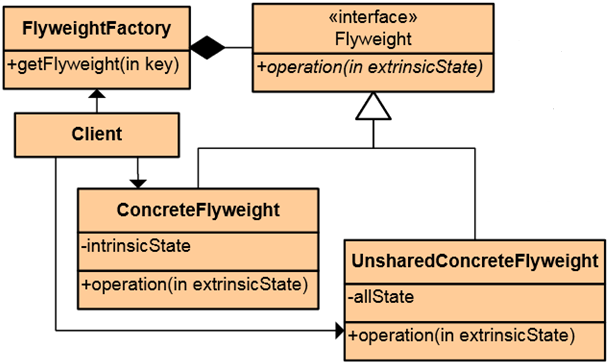

# Structural Patterns Homework #

## Flyweight Pattern ##

----------

### Описание ###

Flyweight Pattern се прилага, когато имаме много сравнително еднакви обекти, заделящи твърде много памет.

### Цел ###

В ситуации, в които много на брой еднотипни обекти биват създадени, шаблонът може да намали значително използваната памет. Това се постига чрез преобразуването на голям брой независими обекти, в малко на брой споделени такива. Ползата от прилагането на шаблона силно зависи от данните, които се съдържат в  обектите.

### Употреба ###

*  String.Intern

### Структура на design pattern-a###

Всеки flyweight обект серазделянаде части:

* state-dependent (extrinsic, as parameter)
* state-independent (intrinsic, shared by factory)

### Участници ###

* FlyweightFactory - създава и управлява множеството от миниобекти. Поддържа пул от миниобекти. При поискване на нов миниобект – създава нов или връща вече съществуващ. Друга отговорност е зачистването на тези обекти, в случай, че паметта започне да свърша например.
* Flyweigh - дефинира интерфейс, чрез който миниобектите могат да получават съобщения и да променят или да връщат резултат на база външното си (extrinsic)  състояние. 
* ConcreteFlyweight - имплементира общия интерфейс за миниобектите; поддържа вътрешното състояние на миниобектите, което трябва да може да се споделя – т.е да не зависи от контекста, в който се използва даден миниобект. 
* UnsharedConcreteFlyweight - понякога имаме миниобекти, които не могат да бъдат споделени. 
* Client - поддържа референции към миниобекти и модифицира тяхното състояние. Също така пази връзка към външното състояние или го изчислява. 

### Имплементация ###

Пример за използване на Flyweight Pattern:

* Създаване на MoneyFactory

**Class diagram:**

**Code:**

        public enum MoneyType
    {
        Metallic,
        Paper
    }

    --------------------

        public interface IMoney
    {
        // IntrinsicState()
        MoneyType MoneyType { get; }
        
        // GetExtrinsicSate()
        void GetDisplayOfMoneyFalling(int moneyValue); 
    }

    --------------------

        public class MetallicMoney : IMoney
    {
        public MoneyType MoneyType
        {
            get { return MoneyType.Metallic; }
        }

        public void GetDisplayOfMoneyFalling(int moneyValue)
        {
            // This method would display graphical representation of a metallic currency like a gold coin   
            Console.WriteLine(string.Format("Displaying a graphical object of {0} currency of value ${1} falling from sky.", MoneyType.ToString(), moneyValue));
        }
    }

    --------------------

            public MoneyType MoneyType
        {
            get { return MoneyType.Paper; }
        }

        // GetExtrinsicState()
        public void GetDisplayOfMoneyFalling(int moneyValue) 
        {
            // This method would display a graphical representation of a paper currency.
            Console.WriteLine(string.Format("Displaying a graphical object of {0} currencyof value ${1} falling from sky.", MoneyType.ToString(), moneyValue));
        }

    --------------------

    public class MoneyFactory
    {
        public static int objectsCount = 0;
        private Dictionary<MoneyType, IMoney> moneyObjects;

        public IMoney GetMoneyToDisplay(MoneyType form)
        {
            if (this.moneyObjects == null)
            {
                this.moneyObjects = new Dictionary<MoneyType, IMoney>();
            }
            else if (this.moneyObjects.ContainsKey(form))
            {
                return this.moneyObjects[form];
            }

            switch (form)
            {
                case MoneyType.Metallic:
                    this.moneyObjects.Add(form, new MetallicMoney());
                    objectsCount++;
                    break;
                case MoneyType.Paper:
                    this.moneyObjects.Add(form, new PaperMoney());
                    objectsCount++;
                    break;
                default:
                    break;
            }

            return this.moneyObjects[form];
        }
    }

    --------------------

        public class MoneyFactoryEngine
    {
        public static void Main(string[] args)
        {
            const int TEN_TOUSENT = 10000;
            
            int[] currencyDenominations = new[] { 1, 5, 10, 20, 50, 100 };
            MoneyFactory moneyFactory = new MoneyFactory();
            
            int sum = 0;
            
            while (sum <= TEN_TOUSENT)
            {
                IMoney graphicalMoneyObj = null;
                Random rand = new Random();
                
                int currencyDisplayValue = currencyDenominations[rand.Next(0, currencyDenominations.Length)];

                if (currencyDisplayValue == 1 || currencyDisplayValue == 5)
                {
                    graphicalMoneyObj = moneyFactory.GetMoneyToDisplay(MoneyType.Metallic);
                }
                else
                {
                    graphicalMoneyObj = moneyFactory.GetMoneyToDisplay(MoneyType.Paper);
                }

                graphicalMoneyObj.GetDisplayOfMoneyFalling(currencyDisplayValue);
                sum = sum + currencyDisplayValue;
            }
            
            Console.WriteLine("Total Objects created=" + MoneyFactory.objectsCount.ToString());
            Console.ReadLine();
        }

    