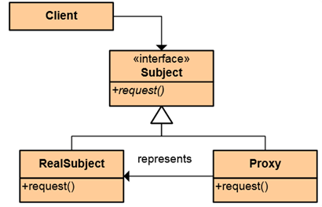
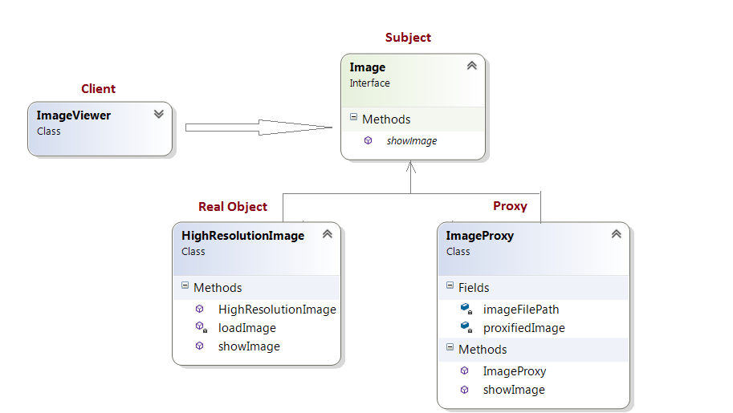

# Structural Patterns Homework #

## Proxy Pattern ##

----------

### Описание ###

Proxy Pattern представя обект, който се представя за друг обект, предлагайки същия интерфейс, като предоставя заместник или контейнер за даден реален обект, позволявайки контролиран достъп до него.
Има 3 основни вида :
* remote proxy - локална репрезентация на обект, който се намира в друг процес, протичащ на отдалечена машина.
* virtual proxy - контролиране на момента на инстанциране и инициализация на обект, заемащ много памет.
* protection proxy - добавя валидация и проверка на права за достъп до обект.

### Цел ###

Понякога се налага да се достъпвват обекти, които са част от отделно приложение, друг домейн или са инсталирани в друга част на света. Идеята на Proxy Pattern-а е да бъде създаде локален модул, който имитира функционалността на истинския модул и приложението да ползва локалния модул така, както би ползвало истинския, а цялата логика по комуникацията с отдалечения модул да бъде изнесена в локалния - самото прокси.

### Употреба ###

*  Remote Proxy - WPF (decouple networking details), COM Callable Wrappers
*  Virtual Proxy - placeholder image, Entity Framework, cached repository 

### Структура на design pattern-a###

### Участници ###

*  Subject - Предоставя интерфейс, който ще бъде имплементиран както от проксито, така и от реалния клас, така че проксито да бъде лесно ползвано като заместител на реалния клас (RealSubject).
*  Proxy - Класът, който ще бъде използван от приложението и предоставя като интерфейс методите на Subject. Приложението използва този клас, който имплементира логиката за комуникация с RealSubject и връща получените данни към локалното приложение.
*  Real Subject - Реалният обект, който съдържа логиката за достъпване на данни/функционалност. Това е класът, който проксито имитира, предоставяйки функционлаността му за ползване от локалното приложение.

### Имплементация ###

Пример за използване на Proxy Pattern:

Създаване на програма за преглед на изображения с висока резолюция. Програмата трябва да се покаже списък на всички снимки като не е задължително да се покаже действителната снимка, до момента в който потребителят не избере елемент от списъкът.

**Class diagram:**

**Code:**

    /// Subject Interface
    public interface Image
    {
        void ShowImage();
    }

        public enum MoneyType
    {
        Metallic,
        Paper
    }

    --------------------

    // Proxy
    public class ImageProxy : Image
    {
        // Private Proxy data 
        private string imageFilePath;

        // Reference to RealSubject
        private Image proxifiedImage;

        public ImageProxy(string imageFilePath)
        {
            this.imageFilePath = imageFilePath;
        }

        public void ShowImage()
        {
            // create the Image Object only when the image is required to be shown
            this.proxifiedImage = new HighResolutionImage(this.imageFilePath);

            // now call showImage on realSubject
            this.proxifiedImage.ShowImage();
        }
    }

    --------------------

    // Image Viewer program
    // RealSubject
    public class HighResolutionImage : Image
    {
        public HighResolutionImage(string imageFilePath)
        {
            this.LoadImage(imageFilePath);
        }

        public void ShowImage()
        {
            // Actual Image rendering logic
        }

        private void LoadImage(string imageFilePath)
        {
            // load Image from disk into memory
            // this is heavy and costly operation
        }
    }

    --------------------

    // Image Viewer program
    public class ImageViewer
    {
        public static void Main(string[] args)
        {
            /// assuming that the user selects a folder that has 3 images	
            ///create the 3 images 	
            Image highResolutionImage1 = new ImageProxy("sample/veryHighResPhoto1.jpeg");
            Image highResolutionImage2 = new ImageProxy("sample/veryHighResPhoto2.jpeg");
            Image highResolutionImage3 = new ImageProxy("sample/veryHighResPhoto3.jpeg");

            // assume that the user clicks on Image one item in a list
            // this would cause the program to call showImage() for that image only
            // note that in this case only image one was loaded into memory
            highResolutionImage1.ShowImage();

            // consider using the high resolution image object directly
            Image highResolutionImageNoProxy1 = new HighResolutionImage("sample/veryHighResPhoto1.jpeg");
            Image highResolutionImageNoProxy2 = new HighResolutionImage("sample/veryHighResPhoto2.jpeg");
            Image highResolutionImageBoProxy3 = new HighResolutionImage("sample/veryHighResPhoto3.jpeg");

            // assume that the user selects image two item from images list
            highResolutionImageNoProxy2.ShowImage();

            // note that in this case all images have been loaded into memory 
            // and not all have been actually displayed
            // this is a waste of memory resources
        }
    }

       