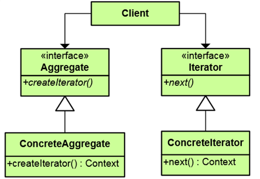
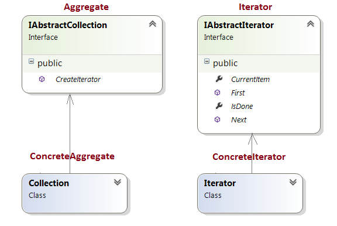

# Behavioral Patterns Homework #

## Iterator Pattern ##

----------

### Описание ###

Итератора предоставя начин за последователен достъп до елементите на обект без да е нужна вътрешна информация за обекта. В компютърното програмиране, итератор е обект, който дава възможност на програмиста да преминава през различни структури от данни. 

### Цел ###

* Скрива имплементационни детайли за самия обект, който ще бъде обикалян.

### Употреба ###

*  Foreach loops в CSharp.

### Структура на design pattern-a###

### Участници ###

*  Iterator - предоставя интерфейс за обекта, който ще бъде обикалян
*  Concrete Iterator -имплементира интерфейса на Iterator-а. Следи текущата позиция при обхождане на агрегата.
*  Aggregate - интерфейс за самят обект, който ще бъде обикалян
*  Concrete Aggregate - имплементира интерфейса на сътворението Iterator, за да се върнете инстанция на съответния ConcreteIterator.

### Имплементация ###

**Class diagram:**

**Code:**

    /// 

    /// The 'Aggregate' interface
    /// 

    public interface IAbstractCollection
    {
        Iterator CreateIterator();
    }

    --------------------

    /// 

    /// The 'Iterator' interface
    /// 

    public interface IAbstractIterator
    {
        bool IsDone { get; }

        Item CurrentItem { get; }

        Item First();

        Item Next();
    }

    --------------------

    /// 

    /// The 'ConcreteAggregate' class
    /// 

    public class Collection : IAbstractCollection
    {
        private ArrayList items = new ArrayList();

        // Gets item count
        public int Count
        {
            get { return this.items.Count; }
        }

        // Indexer
        public object this[int index]
        {
            get { return this.items[index]; }
            set { this.items.Add(value); }
        }

        public Iterator CreateIterator()
        {
            return new Iterator(this);
        }
    }

    --------------------

    /// 

    /// The 'ConcreteIterator' class
    /// 

    public class Iterator : IAbstractIterator
    {
        private Collection collection;
        private int current = 0;
        private int step = 1;

        // Constructor
        public Iterator(Collection collection)
        {
            this.collection = collection;
        }

        // Gets current iterator item
        public Item CurrentItem
        {
            get { return this.collection[this.current] as Item; }
        }

        // Gets whether iteration is complete
        public bool IsDone
        {
            get { return this.current >= this.collection.Count; }
        }

        // Gets or sets stepsize
        public int Step
        {
            get { return this.step; }
            set { this.step = value; }
        }

        // Gets first item
        public Item First()
        {
            this.current = 0;
            return this.collection[this.current] as Item;
        }

        // Gets next item
        public Item Next()
        {
            this.current += this.step;
            if (!this.IsDone)
            {
                return this.collection[this.current] as Item;
            }
            else
            {
                return null;
            }  
        }
    }

    --------------------

    /// 

    /// A collection item
    /// 

    public class Item
    {
        private string name;

        public Item(string name)
        {
            this.name = name;
        }

        public string Name
        {
            get { return this.name; }
        }
    }

    --------------------

    public class MainApp
    {
        /// 

        /// Entry point into console application.
        /// 

        public static void Main()
        {
            // Build a collection
            Collection collection = new Collection();
            collection[0] = new Item("Item 0");
            collection[1] = new Item("Item 1");
            collection[2] = new Item("Item 2");
            collection[3] = new Item("Item 3");
            collection[4] = new Item("Item 4");
            collection[5] = new Item("Item 5");
            collection[6] = new Item("Item 6");
            collection[7] = new Item("Item 7");
            collection[8] = new Item("Item 8");

            // Create iterator
            Iterator iterator = new Iterator(collection);

            // Skip every other item
            iterator.Step = 2;

            Console.WriteLine("Iterating over collection:");

            for (Item item = iterator.First();
                !iterator.IsDone; item = iterator.Next())
            {
                Console.WriteLine(item.Name);
            }
        }
    }

