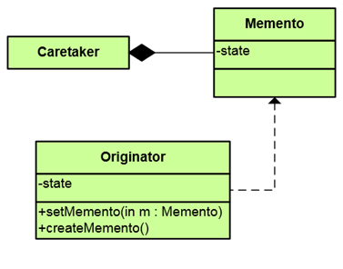
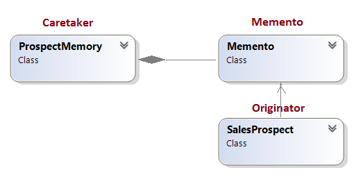

# Behavioral Patterns Homework #

## Memento Pattern ##

----------

### Описание ###

Без да нарушава капсулацията на даден обект, прихваща и изважда вътрешното му състояние с цел да бъде възвърнато това състояние в по-късен етап.

### Цел ###

Осъществява undo or rollback на пълното състояние на оекта.

### Структура на design pattern-a###

### Участници ###

*  Originator - обектът, чието състояние се следи също така и е отговорен за запазване/възстановяване 
*  Caretaker  - осъществява операциите на Originator и същотака съдържа всички състояния 
*  Memento - value object, който съдържа едно състояние на Originator-а (съдържа данните)

### Имплементация ###

Пример за използване на Memento Pattern:

**Class diagram:**

**Code:**

    /// 

    /// The 'Memento' class
    /// 

    public class Memento
    {
        private string name;
        private string phone;
        private double budget;

        // Constructor
        public Memento(string name, string phone, double budget)
        {
            this.name = name;
            this.phone = phone;
            this.budget = budget;
        }

        // Gets or sets name
        public string Name
        {
            get { return this.name; }
            set { this.name = value; }
        }

        // Gets or set phone
        public string Phone
        {
            get { return this.phone; }
            set { this.phone = value; }
        }

        // Gets or sets budget
        public double Budget
        {
            get { return this.budget; }
            set { this.budget = value; }
        }
    }

    --------------------

    /// 

    /// The 'Caretaker' class
    /// 

    public class ProspectMemory
    {
        private Memento memento;

        // Property
        public Memento Memento
        {
            get { return this.memento; }
            set { this.memento = value; }
        }
    }

    --------------------

    /// 

    /// The 'Originator' class
    /// 

    public class SalesProspect
    {
        private string name;
        private string phone;
        private double budget;

        // Gets or sets name
        public string Name
        {
            get 
            {
                return this.name; 
            }

            set
            {
                this.name = value;
                Console.WriteLine("Name:  " + this.name);
            }
        }

        // Gets or sets phone
        public string Phone
        {
            get 
            {
                return this.phone; 
            }

            set
            {
                this.phone = value;
                Console.WriteLine("Phone: " + this.phone);
            }
        }

        // Gets or sets budget
        public double Budget
        {
            get 
            {
                return this.budget; 
            }

            set
            {
                this.budget = value;
                Console.WriteLine("Budget: " + this.budget);
            }
        }

        // Stores memento
        public Memento SaveMemento()
        {
            Console.WriteLine("\nSaving state --\n");
            return new Memento(this.name, this.phone, this.budget);
        }

        // Restores memento
        public void RestoreMemento(Memento memento)
        {
            Console.WriteLine("\nRestoring state --\n");
            this.Name = memento.Name;
            this.Phone = memento.Phone;
            this.Budget = memento.Budget;
        }
    }

    --------------------

    /// 

        /// Entry point into console application.
        /// 

        public static void Main()
        {
            SalesProspect s = new SalesProspect();
            s.Name = "Noel van Halen";
            s.Phone = "(412) 256-0990";
            s.Budget = 25000.0;

            // Store internal state
            ProspectMemory m = new ProspectMemory();
            m.Memento = s.SaveMemento();

            // Continue changing originator
            s.Name = "Leo Welch";
            s.Phone = "(310) 209-7111";
            s.Budget = 1000000.0;

            // Restore saved state
            s.RestoreMemento(m.Memento);
        }
