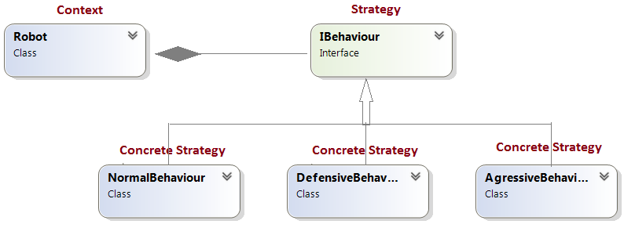

# Behavioral Patterns Homework #

## Strategy Pattern ##

----------

### Описание ###

Дефинира семейство от капсулирани алгоритми и ги прави взаемозаменими. Стратегията позволява промяна на алгоритмите, независимо от клиента, който ги използва.

### Цел ###

* Капсулира семейство от свързани алгоритми.
* Позволява на алгоритъма да варира и да бъде самостоятелен от класа, който го използва.
* Позволява на класа да има една единствена цел.
* Отделя процеса по калкулация от резултатат от самата колкулация.

### Употреба ###

*  Switch/if statements

### Структура на design pattern-a###

### Участници ###

*  Strategy - декларира интерфейс, който е общ за всички поддържащи алгоритми.  Използва този интерфейс да извика алгоритъмът, определен от ConcreteStrategy.
*  Concrete Strategy - имплементира алгоритъма използващ Strategy интерфейс.
*  Context:
   - е конфигуриран в ConcreteStrategy обекта
   - осъществява референция към Strategy обекта
   - може да дефинира интерфейс, който да позволява на Strategy да достъпва негоните данни.

### Имплементация ###

Пример за използване на Strategy Pattern:

IBehaviour (Strategy) - интерфейс, койтодефинира поведениетонаробот. Conctete Strategies: AggressiveBehaviour, DefensiveBehaviour, NormalBehaviour. Robot - context class. Той пази или взима контекстна информация катопозиция, близки препятствия и т.н. и предава необходимате инфолмация на Strategy class-а.

**Class diagram:**

**Code:**

    public interface IBehaviour
    {
        int MoveCommand();
    }

    --------------------

    public class NormalBehaviour : IBehaviour
    {
        public int MoveCommand()
        {
            Console.WriteLine("\tNormal Behaviour: if find another robot ignore it");
            return 0;
        }
    }

    --------------------

    public class DefensiveBehaviour : IBehaviour
    {
        public int MoveCommand()
        {
            Console.WriteLine("\tDefensive Behaviour: if find another robot run from it");
            return -1;
        }
    }

    --------------------

    public class AgressiveBehaviour : IBehaviour
    {
        public int MoveCommand()
        {
            Console.WriteLine("\tAgressive Behaviour: if find another robot attack it");
            return 1;
        }
    }

    --------------------

    public class Robot
    {
        private IBehaviour behaviour;
        private string name;

        public Robot(string name)
        {
            this.name = name;
        }

        public void SetBehaviour(IBehaviour behaviour)
        {
            this.behaviour = behaviour;
        }

        public IBehaviour GetBehaviour()
        {
            return this.behaviour;
        }

        public void Move()
        {
            Console.WriteLine(this.name + ": Based on current position" +
                         "the behaviour object decide the next move:");
            int command = this.behaviour.MoveCommand();

            // ... send the command to mechanisms
            Console.WriteLine("\tThe result returned by behaviour object " +
                        "is sent to the movement mechanisms " +
                        " for the robot '" + this.name + "'");
        }

        public string GetName()
        {
            return this.name;
        }

        public void SetName(string name)
        {
            this.name = name;
        }
    }

    --------------------

    public static void Main()
        {
            Robot r1 = new Robot("Big Robot");
            Robot r2 = new Robot("George v.2.1");
            Robot r3 = new Robot("R2");

            r1.SetBehaviour(new AgressiveBehaviour());
            r2.SetBehaviour(new DefensiveBehaviour());
            r3.SetBehaviour(new NormalBehaviour());

            r1.Move();
            r2.Move();
            r3.Move();

            Console.WriteLine("\r\nNew behaviours: " +
                    "\r\n\t'Big Robot' gets really scared" +
                    "\r\n\t, 'George v.2.1' becomes really mad because" +
                    "it's always attacked by other robots" +
                    "\r\n\t and R2 keeps its calm\r\n");

            r1.SetBehaviour(new DefensiveBehaviour());
            r2.SetBehaviour(new AgressiveBehaviour());

            r1.Move();
            r2.Move();
            r3.Move();
        }

