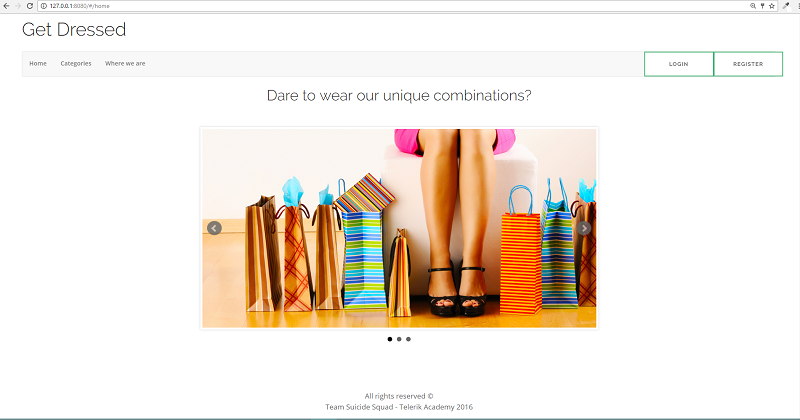
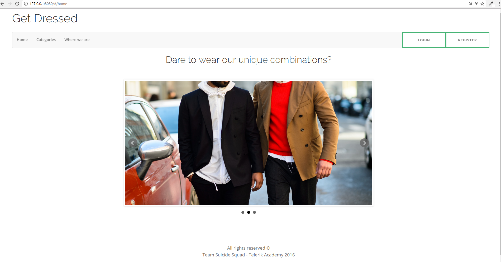
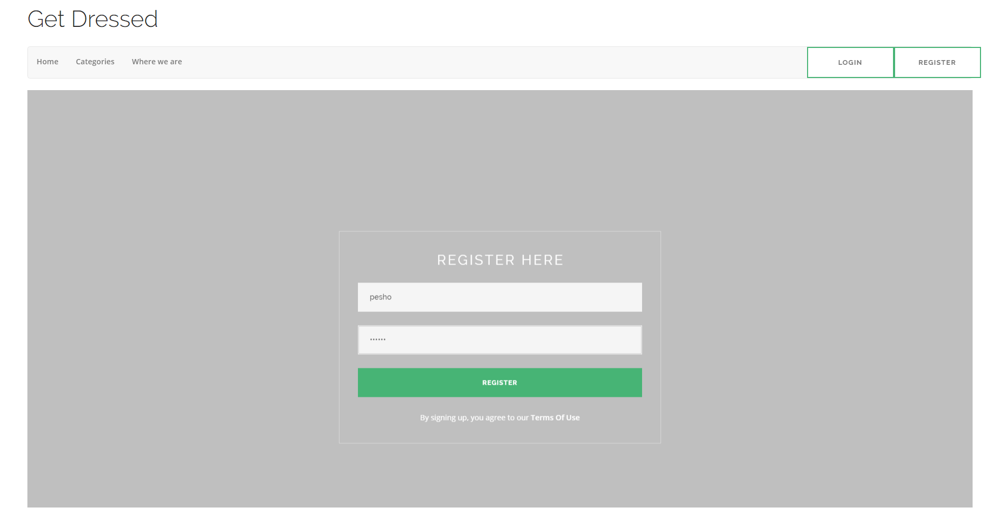
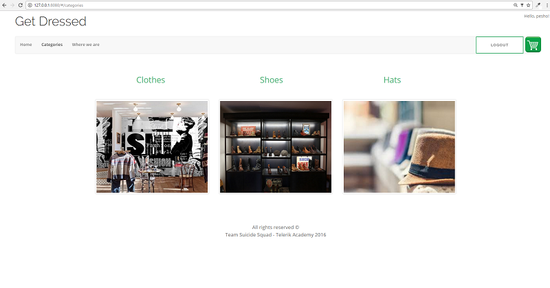
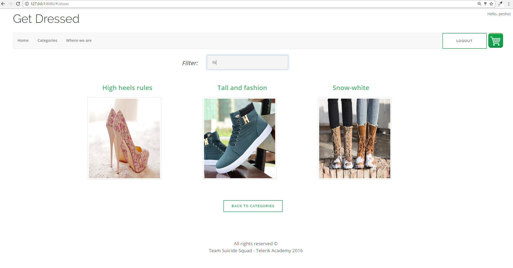
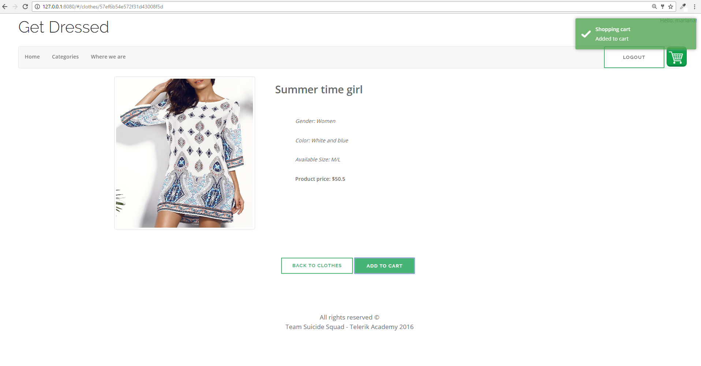
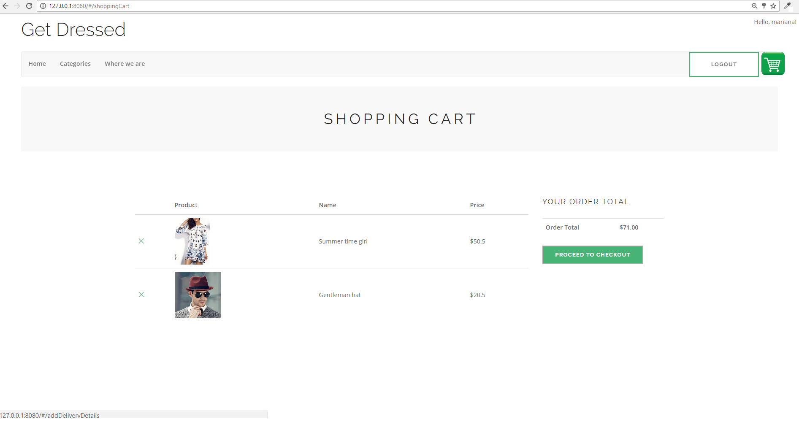
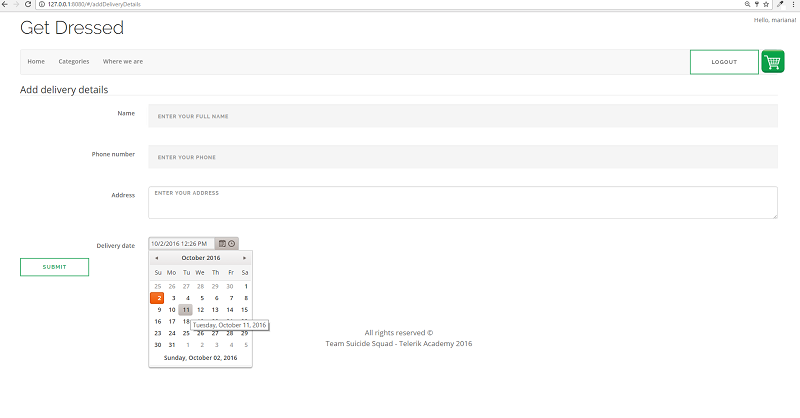

#Get Dressed#

----------

###Project desctiption:###

Get Dressed SPA is online clothes store for purchasing different items: clothes, shoes and hats. 

Basic tehnologies/libraries used: JavaScript, HTML5/CSS, GoogleMaps, jQuery, Navigo.js, Bootsrtap, Toastr.js, KendoUI, Node.js, Kinvey: Mobile Backend as a Service, Mocha and Chai.

Routs:

- #/home - shows image slideShow using jquery.bxSlider.js
- #/login - shows login template for registered user. Shows success/error login message via toastr.js
- #/register -shows register template for new users. Shows success/error login message via toastr.js
- #/logout - logout user
- #/categories - lists all items categories
- #/clothes - lists all clothes items
- #/clothes/:id - shows item detail page. Each item can be added to shopping cart.
- #/shoes - lists all shoes items. Filter by name is avalable.
- #/shoes/:id - shows item detail page. Each item can be added to shopping cart.
- #/hats - lists all hats items. Filter by name is avalable.
- #/hats/:id - shows item detail page. Each item can be added to shopping cart.
- #/contacts - show googleMap location of the store. Filter by name is avalable.
- #/shoppingCart - shows all items added into shopping cart with their total price. Each item can be removed from the cart.
- #/addDeliveryDetails - allows user to add delivery details such as addres, phone and delivery date.

###Live preview:###
[https://rawgit.com/marianamn/Telerik-Academy-Activities/master/Projects/01.%20ClothesStore/ClothesStore/index.html#/home](https://rawgit.com/marianamn/Telerik-Academy-Activities/master/Projects/01.%20ClothesStore/ClothesStore/index.html#/home)

